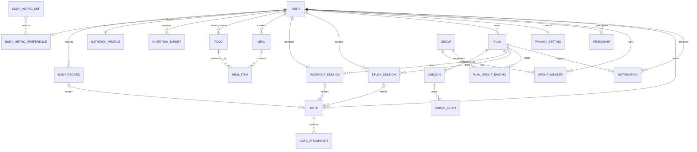

# 数据库 ER 关系设计（1.2.0）

## 关键边界

1. **BodyRecord** 永远保存历史，不覆盖旧值。
2. **BodyMetricPreference** 只决定用户希望看到/录入哪些可选指标，不改变历史结构。
3. **NutritionTarget** 版本化保存，周报按历史日期寻找当时有效目标。
4. **MealItem** 保存营养快照，避免食物库改变后历史数据漂移。
5. **PlanGroupBinding** 是群组强监督边界；群组不自动拥有用户其他隐私数据。
6. **Note** 是统一长期记录模型，通过 `relatedType + relatedId` 关联 Body/Study/Workout/Plan。
7. **NoteAttachment** 独立存储文件元数据，实际图片进入云存储。
8. Notes 在当前版本固定为 PRIVATE；好友/群组读取链路不存在。
9. Notification 使用用户、计划和日期生成确定性 ID，承载站内未读状态及微信推送结果。
