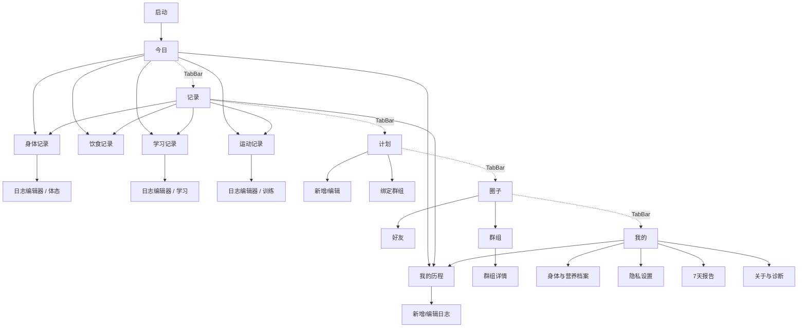

# 页面跳转图（1.0.0）


```mermaid
flowchart TD
    A[启动] --> T[今日]
    T --> B[身体记录]
    T --> F[饮食记录]
    T --> W[运动记录]
    T --> S[学习记录]
    T --> N[我的历程]

    R[记录] --> N
    R --> B
    R --> F
    R --> W
    R --> S

    B --> NE[日志编辑器 / 体态]
    S --> NE2[日志编辑器 / 学习]
    W --> NE3[日志编辑器 / 训练]
    N --> NE4[新增/编辑日志]

    P[计划] --> PE[新增/编辑]
    P --> PB[绑定群组]

    C[圈子] --> CF[好友]
    C --> CG[群组]
    CG --> GD[群组详情]

    M[我的] --> MP[身体与营养档案]
    M --> PR[隐私设置]
    M --> N
    M --> WR[7天报告]
    M --> AB[关于与诊断]

    T -.TabBar.-> R
    R -.TabBar.-> P
    P -.TabBar.-> C
    C -.TabBar.-> M
```

## 自动业务联动

```text
学习/运动记录 → 可选关联计划 → 达到目标 → CheckIn → GroupEvent

身体记录 → 更新营养目标 → 可选继续创建 BODY Note

Note → relatedType + relatedId → 回溯当时的身体/学习/训练上下文
```
